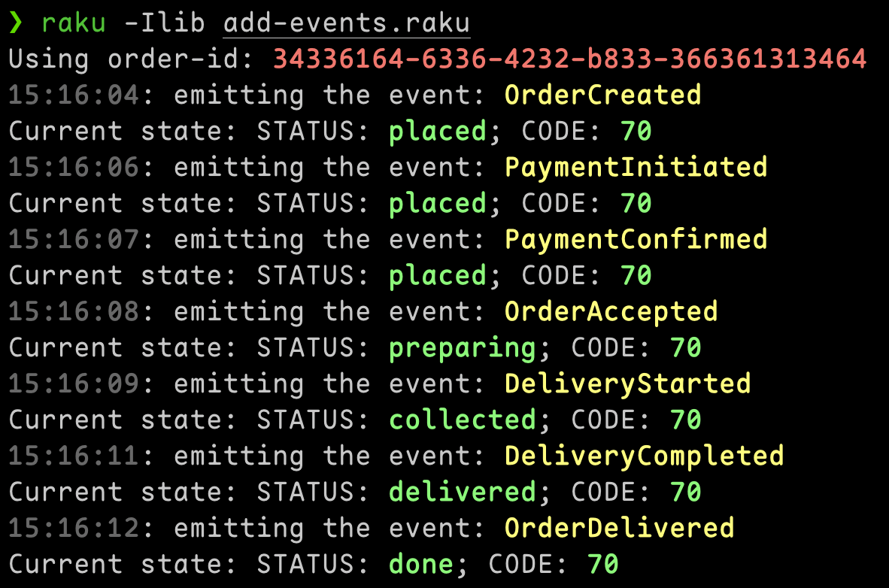

# Sourcing: Part 1 – Exploring Event Sourcing in Raku

I’ve been studying a very interesting approach to
building systems called Event Sourcing. In event sourcing,
every change to an application’s state is captured as an
immutable event. Instead of storing only the current state,
you persist a sequence of events that record all the actions
that have taken place. This approach not only allows for an
accurate reconstruction of the system state by replaying
events but also provides a robust audit log and improves
debugging and analysis capabilities.

For my studies, I started writing a framework to easily
implement event sourcing in Raku. It’s called Sourcing.

Sourcing has a few key concepts. In this first part, we’ll discuss three of them:

1. Events
2. Event Store
3. Projections

## Events

Events are the core building blocks in an event-sourced system.
Each event represents a fact that has occurred in the past,
such as an order being created or a payment being initiated.
Here are some important points about events:

* Immutability:

Once an event is recorded, it should never change.
This immutability guarantees that the historical
record remains accurate and reliable.

* Past Facts:

Events capture facts that have already happened,
meaning they are a definitive record of the state
transitions within your system.

* Audit Trail:

By recording every event, you create a full history of all actions,
making it easier to trace issues or understand
how a certain state was reached.

## Event Store

The Event Store is a specialized storage mechanism for events.
It acts as a single source of truth for all the state changes
in your system by providing these features:

* Append-Only Log:

Events are stored in an append-only manner,
ensuring that once an event is recorded,
it is never modified.

* Order Preservation:

The sequence of events is maintained,
which is critical for reconstructing the state by replaying
the events in the order they occurred.

* Durability and Auditability:

The event store keeps a permanent record of every event,
which can be used for debugging, analytics,
or even recreating the state at any given point in time.

## Projections

Projections are responsible for transforming the raw stream
of events into a read model that is easier to query and work with.
Many projections can/should use the same set of events.
They serve several important functions:

* State Aggregation:

Projections listen to events from the Event Store
and update a view or model that represents the current state of the system.

* Multiple Views:

You can create multiple projections for the same set of events,
each tailored to different client needs. For example,
one projection might track the status of a food order
while another aggregates sales data.

* Decoupling:

By separating the write model (events) from the read model (projections),
you can optimize the performance and scalability of your application.

The following code shows how a projection, DeliveryStatus,
is implemented in our framework.
Each projection must define an apply method for every event it wants to handle.
When an event is emitted, the projection’s corresponding
apply method is called to update its state.

## Food Delivery Example

To demonstrate the framework, let’s build a simple Food Delivery system.
This system uses a few types of events to represent different
stages in the order lifecycle, an example of one of the events class
wold be:

```raku
use Sourcing;
use UUID::V4;

unit event Sourcing::FoodDelivery::Event::OrderCreated;

has Str  $.order-id      = uuid-v4;
has Str  $.delivery-code = (1 ..^ 100) >> .fmt("%02d") .pick;
has UInt $.user-id       is required;
has UInt $.restaurant-id is required;
has Str  %.item{Str};
```

| Event | description |
|:-------|:-------------|
| OrderCreated | Represents when a new order is created. |
| PaymentInitiated | Indicates that the payment process has started. |
| PaymentConfirmed | Signals that the payment was successfully completed. |
| PaymentFailed | Represents a failure or error during the payment process. |
| OrderAccepted | Indicates that the restaurant has accepted the order and begun preparation. |
| DeliveryStarted | Marks the moment when the deliverer collects the order. |
| DeliveryCompleted | Represents the event when the deliverer confirms that the delivery is complete. |
| OrderDelivered | Marks the final stage when the order is successfully delivered. |

## Projection: DeliveryStatus

Projections consume events to maintain a read model. In this example,
the DeliveryStatus projection tracks the status of an order and stores
the delivery code required for the deliverer.

When a projection object is created, it is registered with a manager
(to be described in a future post) and remains in memory until it is
unloaded (a feature still in development).

Projections don't need to use all events and events don't need to be
used by projections. On this example, I'm defining some Payment events
that are not being used by the projection. That's completely ok. if
in the future, a new projection is created, it will consume those events
(if defined to) and generate new objects using those historical data.

```raku
use Sourcing;
use OrderCreated;
use OrderAccepted;
use DeliveryStarted;
use DeliveryCompleted;
use OrderDelivered;

unit projection Sourcing::FoodDelivery::DeliveryStatus;

has Str      $.order-id    is aggregation-id;
has Str      $.status       = "";
has DateTime $.last-status .= now;
has Str      $.delivery-code;

method summary is query{ :sync } {
    %(
        :$!order-id,
        :$!status,
        :$!last-status,
        :$!delivery-code,
    )
}

multi method apply(OrderCreated $_) {
    note "apply OrderCreated";
    $!status        = "placed";
    $!last-status   = .timestamp;
    $!delivery-code = .delivery-code;
}

multi method apply(OrderAccepted $_) {
    note "apply OrderAccepted";
    $!status        = "preparing";
    $!last-status   = .timestamp;
}

multi method apply(DeliveryStarted $_) {
    note "apply DeliveryStarted";
    $!status      = "collected";
    $!last-status = .timestamp;
}

multi method apply(DeliveryCompleted $_) {
    note "apply DeliveryCompleted";
    $!status      = "delivered";
    $!last-status = .timestamp;
}

multi method apply(OrderDelivered $_) {
    note "apply OrderDelivered";
    $!status      = "done";
    $!last-status = .timestamp;
}
```

### The apply Method

Every projection needs an apply method candidate for each
event it intends to handle. When an event is emitted,
the projection automatically calls the corresponding apply
method to update its state based on the event’s data.

### The is query Trait

Methods marked with the is query trait are exposed to clients.
When marked with the :sync parameter, these methods first process
all pending events, ensuring that the projection’s state is
up-to-date before returning the result.

## Usage Example

Note: Although events should ideally be emitted via dedicated commands,
for this example we emit them directly.

```raku
...

my Sourcing::Client $s          = Sourcing::Client.new;
$s.register-class: "DeliveryStatus";
my RedEventStore::Client $store = RedEventStore::Client.new, 
my \DeliveryStatus              = $s.get-class-client("DeliveryStatus");

sub emit-event(Sourcing::Event $event, :$order) {
    say "{ gray $event.timestamp.hh-mm-ss }: emitting the event: { yellow $event.^shortname }";

    $store.add-event: $event;
    given $order.summary {
        say "Current state: STATUS: { green .<status> }; CODE: { green .<delivery-code> }"
    }
    sleep 1
}

sub MAIN(Str :$order-id = uuid-v4) {
    say "Using order-id: { red $order-id }";

    my $order           = DeliveryStatus.new: :$order-id;
    my $user-id         = ^10 .pick;
    my $restaurant-id   = ^10 .pick;
    my $prepare-minutes = 10;
    my $deliverer-id    = ^10 .pick;

    emit-event :$order, OrderCreated.new:      :$order-id, :$user-id, :$restaurant-id;
    emit-event :$order, PaymentInitiated.new:  :$order-id, :payment-data<blablabla>;
    emit-event :$order, PaymentConfirmed.new:  :$order-id;
    emit-event :$order, OrderAccepted.new:     :$order-id, :$restaurant-id, :$prepare-minutes;
    emit-event :$order, DeliveryStarted.new:   :$order-id, :$deliverer-id;
    emit-event :$order, DeliveryCompleted.new: :$order-id, :delivery-code("10");
    emit-event :$order, OrderDelivered.new:    :$order-id;
}
```

Running this, it will print out something like this:


## Projection: UserOrders

Another simple projection we could use here would be a projection
to show all orders of a user. It would be simply consume a single
type of event.
Different from the first projection that aggregates the events
using the order-id, the UserOrders uses the user-id as aggregation-id
to group all event "from" the same user together.
(I plan to, at some point, make it possible to map event attributes
with different named to a aggregation-id on projections).

```raku
use Sourcing;
use OrderCreated;

unit projection Sourcing::FoodDelivery::UserOrders;

has Str $.user-id is aggregation-id;
has Str @.orders;

method users-orders is query {
    @!orders
}

multi method apply(OrderCreated $_) {
    note "apply OrderCreated";
    @!orders.push: .order-id
}
```

## Conclusion

In this post, we explored the fundamentals of event sourcing
and how to implement a basic framework in Raku using the Sourcing library.
We covered the core concepts of events, the event store, and projections,
and demonstrated these ideas with a practical Food Delivery example.
Event sourcing provides a robust foundation for building systems that are scalable,
auditable, and easier to debug. In future posts, we’ll delve deeper into advanced
topics such as command handling, event replay, and integrating with
production-grade data stores. Stay tuned for more insights into building
reliable and resilient systems with event sourcing!
